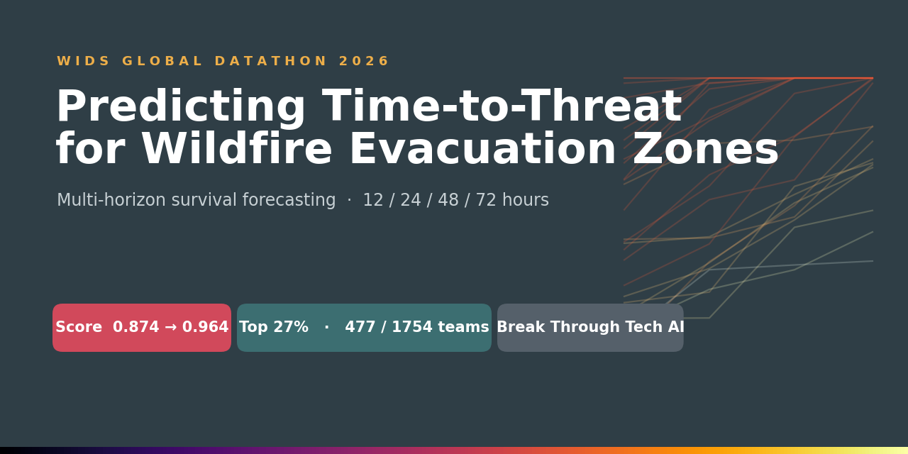
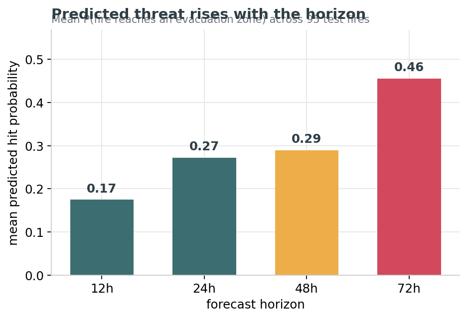
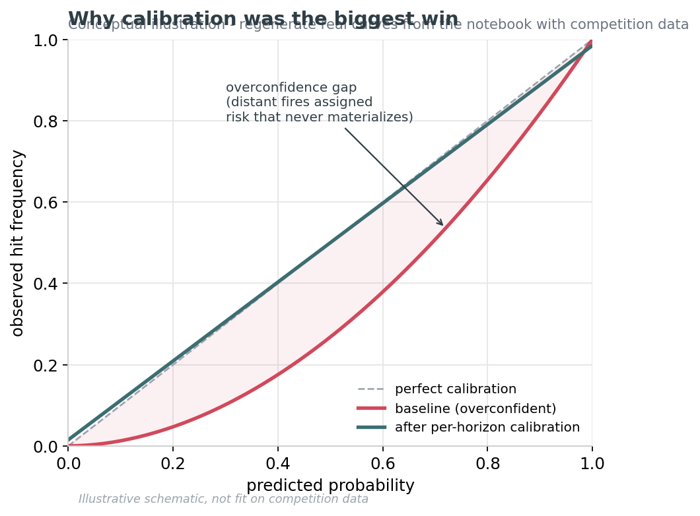
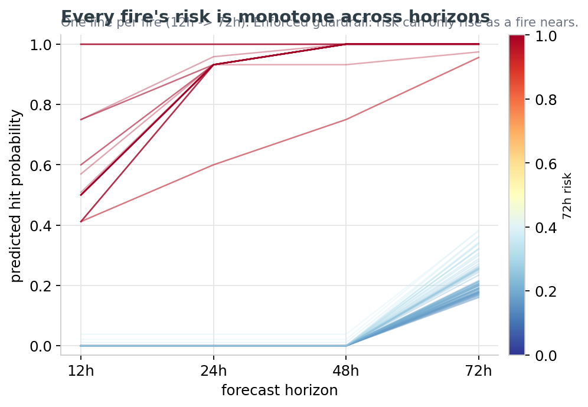
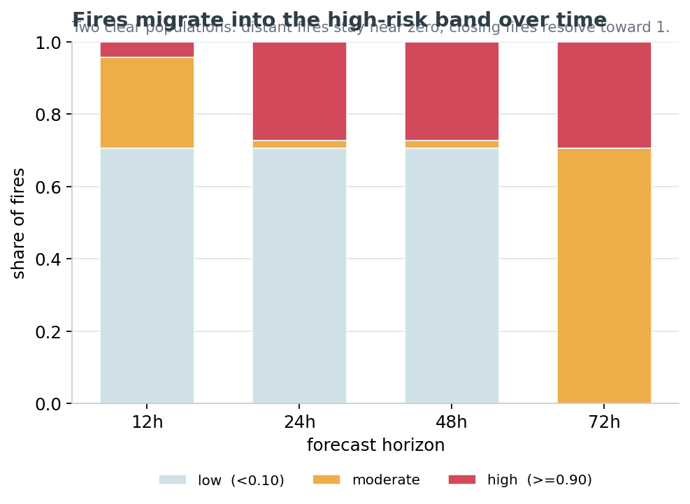

<!-- Tip: also set figures/social_preview.png as the repo's social preview in
     GitHub → Settings → General → Social preview, so it renders when the link is shared. -->

# 🔥 Predicting Time-to-Threat for Wildfire Evacuation Zones

**WiDS Global Datathon 2026 — Survival Analysis Track**
*Break Through Tech AI · Spring 2026 AI Studio*


-d1495b)


> Given only the **first five hours** of a wildfire's behavior, forecast the probability that it
> threatens a nearby evacuation zone within **12, 24, 48, and 72 hours** — a calibrated, multi-horizon
> survival forecast that emergency managers can actually trust.

**Skills demonstrated:** survival analysis · feature engineering · model ensembling · Bayesian
hyperparameter optimization (Optuna) · probability calibration · cross-validation · reproducible ML
pipelines · Python (XGBoost, scikit-survival, scikit-learn).

---

## 📊 Results at a glance

| Model stage | Competition score | Δ vs. baseline |
|---|---|---|
| Provided baseline (XGBoost Cox PH) | **0.87397** | — |
| **Our final ensemble + calibration** | **0.96366** | **+0.08969** |
| Program target | 0.90000 | ✅ exceeded |

> 🏆 **Final leaderboard placement: 477 / 1754 teams — top ~27%**, ahead of roughly **73%** of teams in
> this public, worldwide competition.

Our final pipeline improved the baseline by roughly **9 points** and cleared the program's 0.90
threshold with meaningful margin. The single largest driver of the gain was fixing a **calibration
failure**: the baseline was highly *overconfident* for fires far from any evacuation zone.



*Predicted threat rises with the horizon — mean forecast across the 95 test fires in our submission.*

> ℹ️ *The competition scores this task with a survival-ranking / calibration metric (higher is
> better). Confirm the exact metric name from the Kaggle "Overview → Evaluation" tab and drop it in
> here.*

---

## 🧭 The problem in plain terms

When a wildfire ignites, emergency managers have to decide — fast, and with almost no information —
which communities to warn and where to send resources. This challenge, presented by **Women in Data
Science** in partnership with the wildfire-safety nonprofit **[Watch Duty](https://www.watchduty.org/)**,
frames that decision as a **survival-analysis** problem.

- **What we're given:** features computed strictly from the **first 5 hours** after a fire's initial
  perimeter is detected — early spread dynamics and the fire's spatial relationship to evacuation zones.
- **What we predict:** for each fire, **four probabilities** — the chance the fire comes within **5 km of
  an evacuation-zone centroid** by the 12h, 24h, 48h, and 72h marks.
- **Why it's survival analysis:** the labels are **right-censored**. If a fire reaches a zone within 72h,
  we observe *when* (`time_to_hit_hours`) and the event indicator is 1. If it never does, we only know it
  survived past 72h (censored, event = 0). A plain classifier throws away that timing structure; survival
  models use it.

**Dataset size:** 316 wildfire events with verified early-stage perimeter observations and confirmed
outcomes. This is a **small, high-stakes dataset** — which shaped every modeling decision below (heavy
regularization, cross-validated ensembling, and careful calibration over raw leaderboard-chasing).

---

## 💡 The key insight that drove our score

Early error analysis surfaced a clear failure mode in the baseline:

> The baseline model was **overconfident about distant fires.** It assigned meaningful hit
> probabilities to fires **7–545 km away** from any evacuation zone — even though **no fire in the
> training data ever hit a zone from beyond ~5 km.**

In survival terms, the model's hazard function didn't decay steeply enough with distance, so faraway
fires leaked probability mass they should never have had. Fixing this — through distance-aware features
and, most importantly, **per-horizon calibration** — is where most of our improvement came from. It's
also the change that matters most operationally: a false "this fire will hit you" alert for a fire 300 km
away erodes trust in the whole system.



*Conceptual illustration of the fix. The baseline predicted high probabilities that reality didn't bear
out (the shaded overconfidence gap); per-horizon calibration pulls the curve back onto the diagonal.
Regenerate the real, data-fit version from the walkthrough notebook.*

---

## 🛠️ Our approach

We enhanced the provided baseline along four axes, applied together rather than one at a time:

### 1. Feature engineering (+20 features)
Domain-informed features that make the distance/speed relationship explicit to the model, including:
- **Distance × speed interactions** — a fast fire close to a zone is categorically different from a
  fast fire far away; the raw features made the model infer this, so we encoded it directly.
- **Composite risk scores** — combining proximity, spread rate, and growth acceleration into single
  interpretable risk signals.
- **Distance-decay transforms** — features that let the model express "risk falls off sharply beyond a
  few kilometers," directly countering the overconfidence failure mode.

See [`src/features.py`](src/features.py) and [`docs/methodology.md`](docs/methodology.md) for the full list.

### 2. Diversified survival ensemble
No single survival model was best across all four horizons, so we blended three complementary ones:
- **XGBoost Cox Proportional Hazards** — strong ranking, handles interactions (the baseline family).
- **Random Survival Forest** — robust, non-parametric, resistant to overfitting on a small dataset.
- **Gradient Boosted Survival Trees** — a boosted survival learner with a different bias than RSF.

Ensemble weights were chosen by **cross-validation** rather than guessed, so the blend is tuned to
out-of-fold performance instead of the leaderboard. See [`src/ensemble.py`](src/ensemble.py).

### 3. Hyperparameter optimization with Optuna
We used **Optuna** (Bayesian/TPE search) to tune the XGBoost Cox and tree-based learners, optimizing a
cross-validated survival objective instead of hand-tuning. See [`src/models.py`](src/models.py).

### 4. Per-horizon probability calibration
The single highest-leverage change. Raw survival outputs were **calibrated separately for each of the
four horizons** using both **isotonic regression** and **Platt scaling**, picking the better calibrator
per horizon on held-out data. This is what corrected the distant-fire overconfidence and produced
probabilities that are trustworthy in absolute terms, not just well-ranked. See
[`src/calibration.py`](src/calibration.py).

> **Why calibration matters here:** the competition doesn't just reward *ranking* fires correctly —
> emergency managers need probabilities they can act on. A "70%" needs to mean 70%.

---

## 📁 Repository structure

```
.
├── README.md                     ← you are here
├── requirements.txt              ← pinned dependencies
├── LICENSE                       ← code license (data is NOT redistributed — see data/README.md)
├── .gitignore
│
├── data/
│   └── README.md                 ← how to obtain the competition data (we can't redistribute it)
│
├── notebooks/
│   ├── wildfire_survival_walkthrough.ipynb   ← GitHub version: narrative that imports from src/
│   └── wildfire_survival_kaggle.ipynb        ← Kaggle version: self-contained, runs top-to-bottom
│
├── src/                          ← canonical, reusable implementation of the pipeline
│   ├── config.py                 ← paths, horizons, constants
│   ├── features.py               ← the +20 engineered features
│   ├── models.py                 ← XGBoost Cox, RSF, GBST + Optuna tuning
│   ├── ensemble.py               ← cross-validated ensemble weighting
│   ├── calibration.py            ← per-horizon isotonic / Platt calibration
│   ├── evaluate.py               ← survival metrics + calibration diagnostics
│   └── pipeline.py               ← ties it all together: raw data → submission.csv
│
├── scripts/
│   ├── generate_figures.py       ← builds the README figures from the submission
│   └── build_kaggle_notebook.py  ← regenerates the Kaggle notebook FROM src/ (single source of truth)
│
├── submissions/
│   └── submission_colin.csv      ← our scoring submission (0.96366)
│
├── docs/
│   ├── methodology.md            ← deep dive into the modeling decisions
│   ├── results.md                ← score progression + ablations
│   └── reproducibility.md        ← exact steps to reproduce our submission
│
└── figures/                      ← README/docs charts (generated; regenerate with scripts/)
```

### Two notebooks, one source of truth

| Notebook | Audience | How it's built |
|---|---|---|
| `notebooks/wildfire_survival_walkthrough.ipynb` | GitHub / portfolio reviewers | Narrative that **imports from `src/`** — no duplicated logic. |
| `notebooks/wildfire_survival_kaggle.ipynb` | Kaggle / datathon reviewers | **Auto-generated from `src/`** by `scripts/build_kaggle_notebook.py`; self-contained so it runs in a Kaggle kernel with nothing to install. |

Edit the modules in `src/`, then run `python scripts/build_kaggle_notebook.py` to refresh the Kaggle
notebook. The two never drift because both derive from the same modules.

---

## 🚀 Quick start

```bash
# 1. Clone
git clone https://github.com/<your-username>/wildfire-survival-forecasting.git
cd wildfire-survival-forecasting

# 2. Create an environment (Python 3.10+ recommended)
python -m venv .venv && source .venv/bin/activate      # Windows: .venv\Scripts\activate
pip install -r requirements.txt

# 3. Get the data (see data/README.md — you must accept the Kaggle competition rules)
#    Place train.csv / test.csv into data/

# 4. Reproduce the submission end-to-end
python -m src.pipeline --data-dir data --out submissions/submission.csv

# ...or walk through it interactively (imports from src/)
jupyter lab notebooks/wildfire_survival_walkthrough.ipynb

# Regenerate the README figures / the standalone Kaggle notebook
python scripts/generate_figures.py
python scripts/build_kaggle_notebook.py
```

On Kaggle, just open `notebooks/wildfire_survival_kaggle.ipynb` — it installs its own dependencies and
runs top-to-bottom.

Full, exact reproduction steps are in [`docs/reproducibility.md`](docs/reproducibility.md).

---

## 📤 Submission format

A CSV with one row per fire (`event_id`) and one column per horizon:

```csv
event_id,prob_12h,prob_24h,prob_48h,prob_72h
10662602,0.000000,0.000000,0.000000,0.287615
13353600,0.500000,0.931818,1.000000,1.000000
...
```

Each value is `P(fire comes within 5 km of an evacuation-zone centroid by that horizon)`, and
probabilities are **monotonic across horizons** (a fire can only get closer over time, so
`prob_12h ≤ prob_24h ≤ prob_48h ≤ prob_72h`). Our pipeline enforces this monotonicity explicitly — see
[`src/pipeline.py`](src/pipeline.py).

| Every fire's forecast is monotone | Fires migrate into the high-risk band over time |
|---|---|
|  |  |

*Both plots are computed directly from our actual submission (`submissions/submission_colin.csv`). Left:
one line per fire, 12h→72h — risk only ever rises. Right: two clear populations — distant fires stay near
zero while closing fires resolve toward 1. Regenerate with `python scripts/generate_figures.py`.*

---

## 👥 Team

Built for the **Break Through Tech AI · Spring 2026 AI Studio** as a 3-person team.

| Name | Role | GitHub/LinkedIn |
|---|---|---|
| Colin Emmanuel | Modeling, enhancement & reproducibility | [@Colin-J-Emmanuel](https://github.com/Colin-J-Emmanuel) |
| Jadesola Adebayo | Modeling, enhancement & reproducibility | [@jadesolaadebayo](https://www.linkedin.com/in/jadesolaadebayo/) |
| Shreya Venkat | Modeling, enhancement & reproducibility | [@shreyavenkateswaran](https://github.com/shreyavenkateswaran) |

---

## 🙏 Acknowledgements

- **Women in Data Science (WiDS) Worldwide** for hosting the Global Datathon 2026.
- **[Watch Duty](https://www.watchduty.org/)** for the real-world wildfire data and domain framing.
- **Break Through Tech AI** and our AI Studio Coach for mentorship throughout Spring AI Studio.

---

## ⚖️ License & data use

The **code** in this repository is released under the terms in [`LICENSE`](LICENSE).
The **competition data is not included and is not redistributed here** — it is governed by the WiDS
Datathon's *Attribution-NonCommercial-NoDerivatives* license and Kaggle's competition rules. See
[`data/README.md`](data/README.md) for how to obtain it directly from Kaggle.
